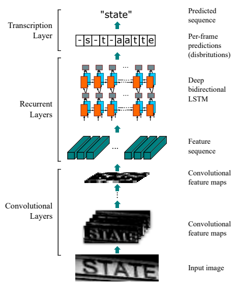

# CNN-LSTM-CTC Model for Optical Character Recognition (OCR)

## General Information
- This is an implementation of the paper ["An End-to-End Trainable Neural Network for Image-based Sequence Recognition and Its Application to Scene Text Recognition"](https://arxiv.org/abs/1507.05717)
- The model consists of three parts: 1) convolutional layers, which extract a feature sequence from the input image; 2) recurrent layers, which predict a label distribution for each frame; 3) transcription layer, which translates the per-frame predictions into the final label sequence.
- The model has four distinctive properties: (1) It is end-to-end trainable,  (2) It naturally handles sequences in arbitrary lengths, involving no character segmentation or horizontal scale normalization, (3) It is not confined to any predefined lexicon and achieves remarkable performances in both lexicon-free and lexicon-based scene text recognition tasks, (4) It generates an effective yet much smaller model, which is more practical for real-world application scenarios.

<p align="center">
  
</p>

- I mainly used TensorFlow 0.12 framework to implement the model.
- A demonstration can be found at [here](https://www.youtube.com/watch?v=Ez9HNpwTOpI).
- In the demonstration, I only used a artificially synthetic dataset, [Synth90k](http://www.robots.ox.ac.uk/~vgg/data/text/), for training the model. However, the resulting model can generalize impressively well on other real-life datasets.

## Instructions
### Build Dataset
In order to optimize the step of loading files in training and validation, we should convert the dataset (images and the corresponding sequencec of characters) into TF-Records.

Some arguments for building the dataset:
- `image_dir`: The path to the directory containing the images
- `imglist_file`: The path to file containing the labels for each image.
- `output_dir`: The directory containing the output dataset.
- `num_threads`: The number of threads used to build the dataset.
- `train_shards`: The number of TF-Record files for the training set.
- `val_shards`: The number of TF-Record files for the validation set.
- `test_shards`: The number of TF-Record files for the test set.

Then we could execute the following command to start building the dataset.
```bash
python build_dataset.py
```

### Train Model
In order to train a model, we execute the following command:
```bash
python train.py
```
Some critical arguments:
- `input_file_pattern`: The pattern of the tranining TF-Records.
- `vgg_checkpoint_file`: The path to the pretrained VGG-16 model. It can be downloaded at [here](http://download.tensorflow.org/models/vgg_16_2016_08_28.tar.gz).
- `ctc_ocr_checkpoint_file`: The path to the resulting checkpoints.
- `train_dir`: The path to the directory saving the results of the training (models and logs for TensorBoard).
- `build_dataset`: Flag indicates whether the VGG would be fine-tuned.
- `number_of_steps`: The maximum number of training steps.

### Evaluate Model
In order to evaluate a resulting model, we execute the following command:
```bash
python evaluate.py
```
Some critical arguments:
- `input_file_pattern`: The pattern of the tranining TF-Records.
- `checkpoint_dir`:  The path to the directory containing the resulting checkpoint.
- `eval_dir`: The path to the directory containing the results of the evaluation (logs for TensorBoard).
- `eval_interval_secs`: The time interval between evaluations.
- `num_eval_examples`: The number of data samples for each evaluation.

### Inference
In order to use a trained model to test a new image, we execute the following command:
```bash
python inference.py
```
Some critical arguments:
- `checkponit_path`: The path to the directory containing the trained model.
- `input_files`: The path to the directory containing the test images.

## Contact
Feel free to contact me (Ba-Hien TRAN) if you have any questions, either by [email](bahientranvn) or by issue.